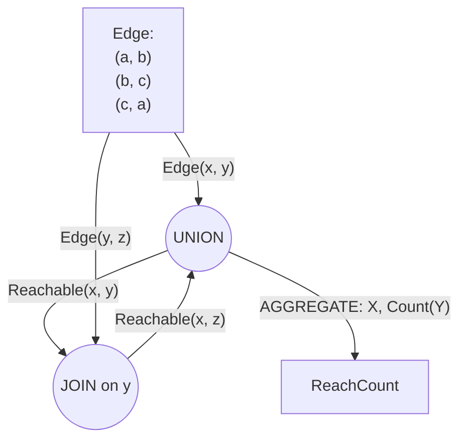

```mermaid
flowchart TD
    EDGES["`
        Edge:
        (a, b)
        (b, c)
        (c, a)
    `"]

    REACHCOUNT["ReachCount"]

    UNION_REACHABLE_TO_EDGE(("UNION"))

    JOIN_REACHABLE_TO_EDGE_ON_Y(("JOIN on y"))

    EDGES 
    -- 
    "Edge(x, y)"
    --> UNION_REACHABLE_TO_EDGE

    UNION_REACHABLE_TO_EDGE
    -- "`
        Reachable(x, y)
    `" -->
    JOIN_REACHABLE_TO_EDGE_ON_Y

    EDGES
    -- "`
        Edge(y, z)
    `" -->
    JOIN_REACHABLE_TO_EDGE_ON_Y

    JOIN_REACHABLE_TO_EDGE_ON_Y
    -- "`
        Reachable(x, z)
    `" -->
    UNION_REACHABLE_TO_EDGE

    UNION_REACHABLE_TO_EDGE
    -- "`
        AGGREGATE: X, Count(Y)
    `" -->
    REACHCOUNT

```