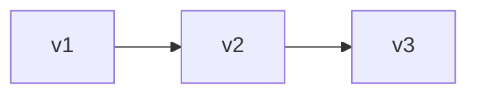
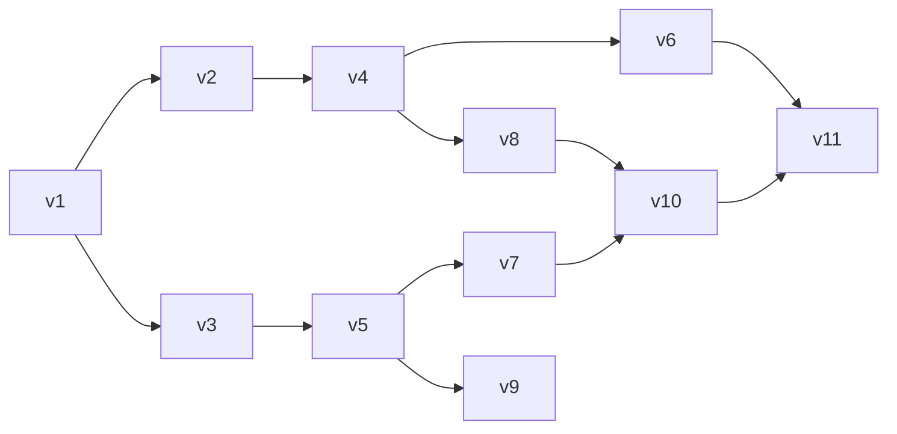

# Differential Dataflow

## Introduction
 * Storage got cheaper and network got faster, so the availability of large datasets that are constantly being updated increased
 * This mutating datasets are extremely valuable, so we need to be able to perform complex analysis to them
 * Recent research has focused on **incremental computation**, including approaches that add **looping constructs** or enable **efficient incremental iterative computation**.
 * No system that efficiently supports **general incremental updates to complex iterative computations** had been demonstrated before.
 * `Differential Computation`, is a **general approach** to traditional incremental computation, that adds value when combined with `interactive algorithms`.
 * Computation state evolves over a `partially ordered set of versions`, rather than a single linear history [[1](#1-totally-ordered-vs-partial-ordered-sets)].
 * The above note is helpful as it allows `multiple versions to coexist` and be compared, unlike standard incremental computation which uses a totally ordered sequence [[2](#2-versioned-vs-incremental-updates)]
 * Both the state and the updates are associated with `multi-dimensional logical timestamps`, thats why we can use the term `update`
 * Enables efficient re-use of computations: current version (i, j) (j-th iteration of a loop on the i-th input round) can use work from both predecessors (i−1, j) and (i, j−1) instead of only the most recently processed version.
* Incremental systems must both, `efficiently update computations` when inputs change, and `track how outputs depend on inputs`.
Differential computation focuses on `efficient updates`, but this makes the update logic more complex.
* `Differential dataflow`, is complete system mode that can be described as a form of `dataflow` that is combined with `data-parallelism` technics in order to efficiently track dependencies.
* Similar goals where handled by `IVM` (Incremental View Maintenance) but in large-scale computations the algorithms are inefficient
* The authors implemented such a system called `Naiad` and battle tested in real-world datasets.

#

## Notes:

#### 1. `Totally Ordered` vs `Partial Ordered`*'` sets:

`Totally ordered` sets, are sets that each version of them depends on the previous one:

That means that the changes are a **totally ordered sequence** (: every version has a clear “before” and “after").

`Partially ordered ` sets (poset), are the sets that the computation’s state doesn’t follow one simple line of versions, but it branches:

That means that some versions may be related (: v1 -> v2) but others are independent (: v3 and v4).

#### 2. `Versioned` vs `Incremental` updates:

There are two ways to **handle updates**:

1. `Versioned` approach:
   
   Every **change** in data (: update) is stored in a **well-organized list or database** (: indexed data structure).
   
   In order to to go back on a previous state of data, you have to **recreate** what the data looked liked by undoing the **changes** stored on list/database.

2. `Incremental` approach:

    Every **change** in data (: update) is applied to data **immediately** without any bookkeeping.
    
    This means that there is **no easy way** to retrieve the **previous state** of the data.

#### 3. `Logical timestamps`:

A `logical timestamp` is a way to keep track of the ordering of events or versions.

There can be either `single-dimensional` or `multi-dimensional`.

1. `Single-dimensional` timestamps:
   
   Is a counter that represents the `time` or order of an event/update without `relying on real clocks`

2. `Multi-dimmensional` timestamps:
   
   In case of `poset` [[1]](#1-totally-ordered-vs-partial-ordered-sets), multiple **events**/**updates** can happen **concurrently** in different **threads**/**versions**. In this case, instead of a single `counter` we keep a `vector of counters`, one per **thread**/**version**, in order to capture all possible casual relationships.